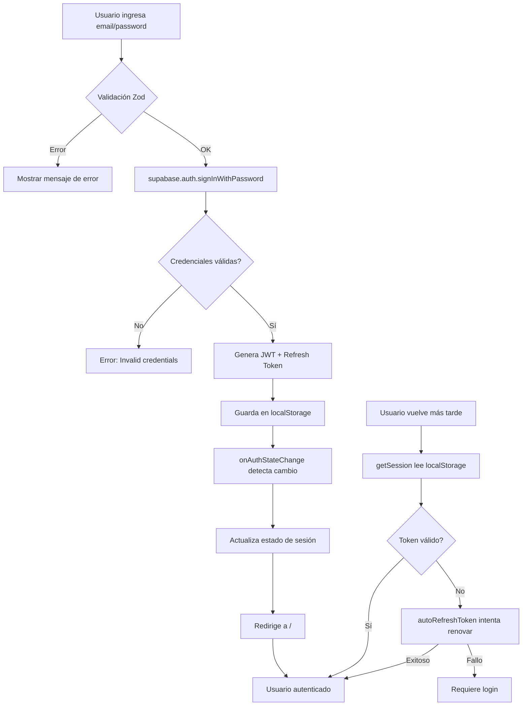
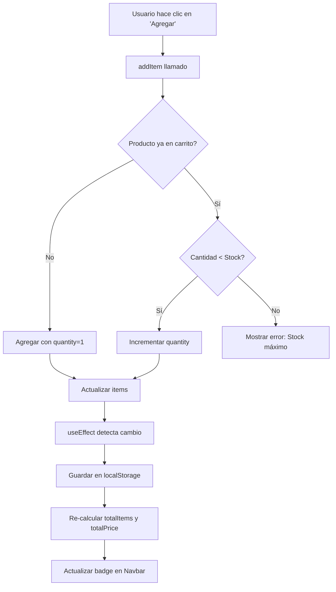
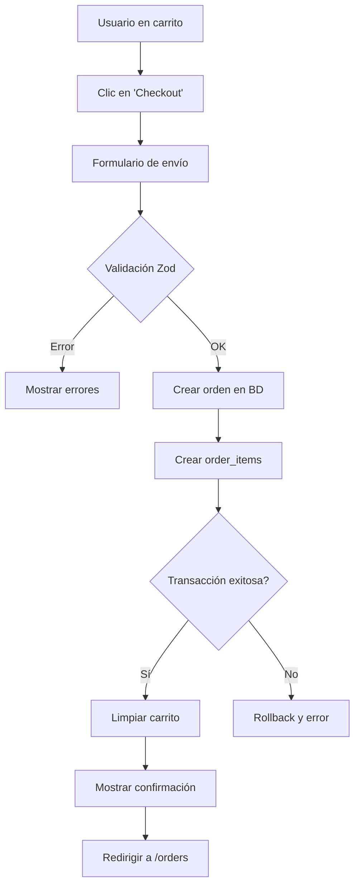

# Explicación Detallada del Código - VapeCode

## Índice
1. [Estructura del Proyecto](#estructura-del-proyecto)
2. [Arquitectura Frontend](#arquitectura-frontend)
3. [Sistema de Autenticación](#sistema-de-autenticación)
4. [Contexto del Carrito](#contexto-del-carrito)
5. [Componentes Principales](#componentes-principales)
6. [Base de Datos y Backend](#base-de-datos-y-backend)
7. [Flujo de Datos](#flujo-de-datos)

---

## 1. Estructura del Proyecto

```
vapecode/
├── src/
│   ├── components/          # Componentes reutilizables
│   │   ├── ui/             # Componentes UI (shadcn)
│   │   ├── Navbar.tsx      # Barra de navegación
│   │   ├── ProductCard.tsx # Tarjeta de producto
│   │   └── AgeVerification.tsx # Modal de verificación
│   ├── contexts/           # Contextos de React
│   │   └── CartContext.tsx # Estado global del carrito
│   ├── pages/              # Páginas de la aplicación
│   │   ├── Index.tsx       # Página principal
│   │   ├── Auth.tsx        # Autenticación
│   │   ├── Products.tsx    # Catálogo
│   │   ├── ProductDetail.tsx # Detalle de producto
│   │   ├── Cart.tsx        # Carrito
│   │   └── Admin.tsx       # Panel admin
│   ├── integrations/       # Integraciones externas
│   │   └── supabase/       # Cliente y tipos de Supabase
│   ├── hooks/              # Hooks personalizados
│   ├── lib/                # Utilidades
│   ├── App.tsx             # Componente raíz
│   ├── main.tsx            # Punto de entrada
│   └── index.css           # Estilos globales
├── public/                 # Archivos estáticos
├── supabase/              # Configuración de Supabase
│   └── migrations/        # Migraciones de BD
└── package.json           # Dependencias
```

---

## 2. Arquitectura Frontend

### 2.1 Stack Tecnológico

**React 18.3 + TypeScript**
```typescript
// main.tsx - Punto de entrada
import { createRoot } from "react-dom/client";
import App from "./App.tsx";
import "./index.css";
import { CartProvider } from "./contexts/CartContext";

createRoot(document.getElementById("root")!).render(
  <CartProvider>  {/* Proveedor global del carrito */}
    <App />
  </CartProvider>
);
```

**Explicación:**
- `CartProvider` envuelve toda la app para que cualquier componente pueda acceder al carrito
- `createRoot` es la nueva API de React 18 para renderizado concurrente
- TypeScript proporciona tipado estático para prevenir errores

### 2.2 Routing (React Router v6)

```typescript
// App.tsx - Configuración de rutas
import { BrowserRouter, Routes, Route } from "react-router-dom";

function App() {
  return (
    <BrowserRouter>
      <Routes>
        <Route path="/" element={<Index />} />
        <Route path="/products" element={<Products />} />
        <Route path="/product/:id" element={<ProductDetail />} />
        <Route path="/cart" element={<Cart />} />
        <Route path="/auth" element={<Auth />} />
        <Route path="/admin" element={<Admin />} />
        <Route path="*" element={<NotFound />} />
      </Routes>
    </BrowserRouter>
  );
}
```

**Explicación:**
- `BrowserRouter` habilita navegación SPA (Single Page Application)
- `:id` es un parámetro dinámico que se extrae con `useParams()`
- `*` captura rutas no encontradas (404)

### 2.3 Sistema de Diseño (TailwindCSS + Tokens)

```css
/* index.css - Tokens de diseño */
:root {
  --background: 0 0% 5%;           /* Negro profundo */
  --foreground: 0 0% 98%;          /* Blanco */
  --primary: 220 100% 60%;         /* Azul eléctrico */
  --secondary: 270 100% 65%;       /* Púrpura */
  
  --gradient-primary: linear-gradient(
    135deg, 
    hsl(var(--primary)), 
    hsl(var(--secondary))
  );
  
  --shadow-glow: 0 0 40px hsl(var(--primary) / 0.4);
}
```

**Explicación:**
- Variables CSS para tema consistente
- HSL permite ajuste dinámico de colores
- Tokens reutilizables evitan hardcodear valores

---

## 3. Sistema de Autenticación

### 3.1 Cliente Supabase

```typescript
// src/integrations/supabase/client.ts
import { createClient } from '@supabase/supabase-js';
import type { Database } from './types';

const SUPABASE_URL = import.meta.env.VITE_SUPABASE_URL;
const SUPABASE_KEY = import.meta.env.VITE_SUPABASE_PUBLISHABLE_KEY;

export const supabase = createClient<Database>(
  SUPABASE_URL, 
  SUPABASE_KEY,
  {
    auth: {
      storage: localStorage,        // ✅ Persistencia local
      persistSession: true,          // ✅ Mantener sesión
      autoRefreshToken: true,        // ✅ Renovar automáticamente
    }
  }
);
```

**Explicación:**
- `localStorage` guarda tokens JWT localmente
- `persistSession: true` mantiene sesión entre recargas
- `autoRefreshToken: true` renueva token antes de expirar (1h)

**Seguridad:**
- Tokens firmados con HS256
- Refresh token con expiración de 7 días
- No se almacenan contraseñas, solo hashes bcrypt en BD

### 3.2 Página de Autenticación (Auth.tsx)

```typescript
// src/pages/Auth.tsx
const Auth = () => {
  const [session, setSession] = useState<Session | null>(null);

  useEffect(() => {
    // 1. Listener de cambios (CRÍTICO: va primero)
    const { data: { subscription } } = supabase.auth.onAuthStateChange(
      (event, session) => {
        setSession(session);
        if (session && event === 'SIGNED_IN') {
          navigate("/");  // Redirige al iniciar sesión
        }
      }
    );

    // 2. Recuperar sesión existente
    supabase.auth.getSession().then(({ data: { session } }) => {
      setSession(session);
      if (session) {
        navigate("/");  // Usuario ya autenticado
      }
    });

    return () => subscription.unsubscribe();
  }, [navigate]);
```

**Explicación del flujo:**

1. **Primera carga:**
   - `onAuthStateChange` se suscribe a cambios
   - `getSession()` busca token en localStorage
   - Si existe token válido → redirige a `/`

2. **Login exitoso:**
   - `signInWithPassword()` valida credenciales
   - Supabase devuelve JWT + refresh token
   - Guarda automáticamente en localStorage
   - `onAuthStateChange` detecta cambio → redirige

3. **Usuario vuelve (sesión persistente):**
   - `getSession()` encuentra token en localStorage
   - Verifica validez del token
   - Si es válido → restaura sesión
   - Si expiró → intenta refresh automático

**Validación de entrada:**
```typescript
const authSchema = z.object({
  email: z.string()
    .trim()                    // Elimina espacios
    .email()                   // Valida formato
    .max(255)                  // Límite de longitud
    .toLowerCase(),            // Normaliza a minúsculas
  
  password: z.string()
    .min(6)                    // Mínimo 6 caracteres
    .max(100),                 // Máximo 100 caracteres
});

// Uso
try {
  const validated = authSchema.parse({ email, password });
  // Solo usa validated.email y validated.password
} catch (error) {
  if (error instanceof z.ZodError) {
    toast.error(error.errors[0].message);
  }
}
```

### 3.3 Navbar con Estado de Autenticación

```typescript
// src/components/Navbar.tsx
export const Navbar = () => {
  const [user, setUser] = useState<User | null>(null);
  const [isAdmin, setIsAdmin] = useState(false);

  useEffect(() => {
    // Recuperar sesión
    supabase.auth.getSession().then(({ data: { session } }) => {
      setUser(session?.user ?? null);
      if (session?.user) {
        checkAdminRole(session.user.id);
      }
    });

    // Listener de cambios
    const { data: { subscription } } = supabase.auth.onAuthStateChange(
      (_event, session) => {
        setUser(session?.user ?? null);
        if (session?.user) {
          checkAdminRole(session.user.id);
        } else {
          setIsAdmin(false);
        }
      }
    );

    return () => subscription.unsubscribe();
  }, []);

  const checkAdminRole = async (userId: string) => {
    const { data } = await supabase
      .from("user_roles")
      .select("role")
      .eq("user_id", userId)
      .eq("role", "admin")
      .maybeSingle();
    
    setIsAdmin(!!data);  // ✅ Verificación servidor-side
  };
```

**Seguridad:**
- Rol de admin verificado en servidor (tabla `user_roles`)
- No se confía en localStorage para autorización
- Cada cambio de sesión re-verifica roles

---

## 4. Contexto del Carrito

### 4.1 CartContext.tsx

```typescript
// src/contexts/CartContext.tsx
export interface CartItem {
  id: string;
  name: string;
  price: number;
  image?: string;
  brand?: string;
  quantity: number;
  stock: number;
}

interface CartContextType {
  items: CartItem[];
  addItem: (item: Omit<CartItem, "quantity">) => void;
  removeItem: (id: string) => void;
  updateQuantity: (id: string, quantity: number) => void;
  clearCart: () => void;
  totalItems: number;
  totalPrice: number;
}

const CartContext = createContext<CartContextType | undefined>(undefined);

export const CartProvider = ({ children }: { children: ReactNode }) => {
  // Inicializar desde localStorage
  const [items, setItems] = useState<CartItem[]>(() => {
    const savedCart = localStorage.getItem("vape-cart");
    return savedCart ? JSON.parse(savedCart) : [];
  });

  // Guardar en localStorage cada vez que cambie
  useEffect(() => {
    localStorage.setItem("vape-cart", JSON.stringify(items));
  }, [items]);

  const addItem = (item: Omit<CartItem, "quantity">) => {
    setItems((prevItems) => {
      const existingItem = prevItems.find((i) => i.id === item.id);
      
      if (existingItem) {
        // Verificar stock antes de aumentar
        if (existingItem.quantity >= item.stock) {
          toast.error("Stock máximo alcanzado");
          return prevItems;
        }
        return prevItems.map((i) =>
          i.id === item.id
            ? { ...i, quantity: i.quantity + 1 }
            : i
        );
      }
      
      return [...prevItems, { ...item, quantity: 1 }];
    });
  };

  const totalItems = items.reduce((sum, item) => sum + item.quantity, 0);
  const totalPrice = items.reduce(
    (sum, item) => sum + item.price * item.quantity, 
    0
  );

  return (
    <CartContext.Provider
      value={{
        items,
        addItem,
        removeItem,
        updateQuantity,
        clearCart,
        totalItems,
        totalPrice,
      }}
    >
      {children}
    </CartContext.Provider>
  );
};

export const useCart = () => {
  const context = useContext(CartContext);
  if (context === undefined) {
    throw new Error("useCart must be used within a CartProvider");
  }
  return context;
};
```

**Explicación:**

1. **Estado persistente:**
   - Guarda carrito en localStorage
   - Recupera al recargar página
   - Formato JSON serializable

2. **Lógica de negocio:**
   - Valida stock antes de agregar
   - Suma cantidades si producto ya existe
   - Calcula totales automáticamente

3. **Seguridad:**
   - Validación de cantidad vs stock
   - No permite negativos
   - Límite máximo por producto

### 4.2 Uso en Componentes

```typescript
// En cualquier componente hijo
import { useCart } from "@/contexts/CartContext";

function ProductCard({ product }) {
  const { addItem } = useCart();

  const handleAddToCart = () => {
    addItem({
      id: product.id,
      name: product.name,
      price: product.price,
      image: product.images[0],
      brand: product.brand,
      stock: product.stock,
    });
    toast.success("Producto agregado");
  };

  return <Button onClick={handleAddToCart}>Agregar</Button>;
}
```

---

## 5. Componentes Principales

### 5.1 ProductCard.tsx

```typescript
// src/components/ProductCard.tsx
export const ProductCard = ({ 
  id, name, price, image, brand, stock 
}: ProductCardProps) => {
  const { addItem } = useCart();

  const handleAddToCart = (e: React.MouseEvent) => {
    e.preventDefault();      // Prevenir navegación
    e.stopPropagation();     // Detener propagación
    
    addItem({ id, name, price, image, brand, stock });
    toast.success("Producto agregado al carrito");
  };

  return (
    <Link to={`/product/${id}`}>
      <Card className="hover:shadow-glow transition-all">
        
        
        <CardContent>
          {brand && <p className="text-muted-foreground">{brand}</p>}
          <h3 className="font-semibold">{name}</h3>
          
          <div className="flex justify-between">
            <p className="text-primary">${price.toFixed(2)}</p>
            {stock > 0 ? (
              <p>Stock: {stock}</p>
            ) : (
              <p className="text-destructive">Sin stock</p>
            )}
          </div>
        </CardContent>
        
        <CardFooter>
          <Button 
            disabled={stock === 0}
            onClick={handleAddToCart}
          >
            Agregar al Carrito
          </Button>
        </CardFooter>
      </Card>
    </Link>
  );
};
```

**Explicación:**
- `e.preventDefault()` evita navegación al hacer clic en botón
- `e.stopPropagation()` evita que evento suba al Link
- Validación de stock antes de mostrar botón

### 5.2 Products.tsx (Catálogo)

```typescript
// src/pages/Products.tsx
const Products = () => {
  const [products, setProducts] = useState<any[]>([]);
  const [categories, setCategories] = useState<any[]>([]);
  const [selectedCategory, setSelectedCategory] = useState("all");
  const [sortBy, setSortBy] = useState("name");
  const [searchTerm, setSearchTerm] = useState("");

  useEffect(() => {
    loadProducts();
  }, [selectedCategory, sortBy, searchTerm]);

  const loadProducts = async () => {
    let query = supabase
      .from("products")
      .select("*")
      .eq("active", true);  // Solo productos activos

    // Filtro por categoría
    if (selectedCategory !== "all") {
      query = query.eq("category_id", selectedCategory);
    }

    // Búsqueda por nombre o marca
    if (searchTerm) {
      query = query.or(`name.ilike.%${searchTerm}%,brand.ilike.%${searchTerm}%`);
    }

    // Ordenamiento
    if (sortBy === "price_asc") {
      query = query.order("price", { ascending: true });
    } else if (sortBy === "price_desc") {
      query = query.order("price", { ascending: false });
    } else {
      query = query.order("name");
    }

    const { data } = await query;
    if (data) setProducts(data);
  };

  return (
    <div>
      {/* Filtros */}
      <Input 
        placeholder="Buscar..." 
        onChange={(e) => setSearchTerm(e.target.value)} 
      />
      
      <Select value={selectedCategory} onValueChange={setSelectedCategory}>
        <SelectItem value="all">Todas</SelectItem>
        {categories.map(cat => (
          <SelectItem key={cat.id} value={cat.id}>{cat.name}</SelectItem>
        ))}
      </Select>

      {/* Grid de productos */}
      <div className="grid grid-cols-1 md:grid-cols-4 gap-6">
        {products.map(product => (
          <ProductCard key={product.id} {...product} />
        ))}
      </div>
    </div>
  );
};
```

**Explicación:**
- `useEffect` recarga productos al cambiar filtros
- `.ilike` es case-insensitive LIKE en PostgreSQL
- `.or()` permite búsqueda en múltiples campos
- Ordenamiento dinámico según selección

### 5.3 Cart.tsx

```typescript
// src/pages/Cart.tsx
const Cart = () => {
  const { items, removeItem, updateQuantity, totalPrice, clearCart } = useCart();

  if (items.length === 0) {
    return <EmptyCartView />;
  }

  return (
    <div className="grid lg:grid-cols-3 gap-8">
      {/* Lista de productos */}
      <div className="lg:col-span-2">
        {items.map(item => (
          <Card key={item.id}>
            
            
            <div>
              <h3>{item.name}</h3>
              
              {/* Controles de cantidad */}
              <div className="flex items-center">
                <Button 
                  onClick={() => updateQuantity(item.id, item.quantity - 1)}
                >
                  <Minus />
                </Button>
                
                <span>{item.quantity}</span>
                
                <Button 
                  onClick={() => updateQuantity(item.id, item.quantity + 1)}
                  disabled={item.quantity >= item.stock}
                >
                  <Plus />
                </Button>
              </div>

              <p>${(item.price * item.quantity).toFixed(2)}</p>
              
              <Button onClick={() => removeItem(item.id)}>
                <Trash2 />
              </Button>
            </div>
          </Card>
        ))}
      </div>

      {/* Resumen */}
      <Card className="sticky top-24">
        <h2>Resumen del Pedido</h2>
        <p>Total: ${totalPrice.toFixed(2)}</p>
        <Button onClick={() => navigate("/checkout")}>
          Proceder al Checkout
        </Button>
      </Card>
    </div>
  );
};
```

**Explicación:**
- `sticky top-24` mantiene resumen visible al hacer scroll
- `disabled` previene exceder stock
- `updateQuantity(id, 0)` elimina producto

---

## 6. Base de Datos y Backend

### 6.1 Esquema de Base de Datos

```sql
-- Enum de roles
CREATE TYPE app_role AS ENUM ('admin', 'user');

-- Tabla de perfiles
CREATE TABLE profiles (
  id UUID PRIMARY KEY REFERENCES auth.users(id),
  email TEXT NOT NULL,
  full_name TEXT,
  phone TEXT,
  date_of_birth DATE,
  created_at TIMESTAMPTZ DEFAULT now(),
  updated_at TIMESTAMPTZ DEFAULT now()
);

-- Tabla de roles
CREATE TABLE user_roles (
  id UUID PRIMARY KEY DEFAULT gen_random_uuid(),
  user_id UUID NOT NULL REFERENCES auth.users(id) ON DELETE CASCADE,
  role app_role NOT NULL,
  created_at TIMESTAMPTZ DEFAULT now(),
  UNIQUE(user_id, role)
);

-- Tabla de categorías
CREATE TABLE categories (
  id UUID PRIMARY KEY DEFAULT gen_random_uuid(),
  name TEXT NOT NULL,
  slug TEXT NOT NULL UNIQUE,
  description TEXT,
  image_url TEXT,
  created_at TIMESTAMPTZ DEFAULT now()
);

-- Tabla de productos
CREATE TABLE products (
  id UUID PRIMARY KEY DEFAULT gen_random_uuid(),
  name TEXT NOT NULL,
  slug TEXT NOT NULL UNIQUE,
  description TEXT,
  price NUMERIC NOT NULL CHECK (price > 0),
  stock INTEGER NOT NULL DEFAULT 0 CHECK (stock >= 0),
  brand TEXT,
  category_id UUID REFERENCES categories(id),
  images TEXT[],  -- Array de URLs
  nicotine_level TEXT,
  featured BOOLEAN DEFAULT false,
  active BOOLEAN DEFAULT true,
  created_at TIMESTAMPTZ DEFAULT now(),
  updated_at TIMESTAMPTZ DEFAULT now()
);

-- Tabla de pedidos
CREATE TABLE orders (
  id UUID PRIMARY KEY DEFAULT gen_random_uuid(),
  user_id UUID NOT NULL,
  total NUMERIC NOT NULL,
  status TEXT NOT NULL DEFAULT 'pending',
  shipping_address TEXT NOT NULL,
  shipping_city TEXT NOT NULL,
  shipping_postal_code TEXT NOT NULL,
  shipping_phone TEXT NOT NULL,
  notes TEXT,
  created_at TIMESTAMPTZ DEFAULT now(),
  updated_at TIMESTAMPTZ DEFAULT now()
);

-- Tabla de items de pedidos
CREATE TABLE order_items (
  id UUID PRIMARY KEY DEFAULT gen_random_uuid(),
  order_id UUID NOT NULL REFERENCES orders(id) ON DELETE CASCADE,
  product_id UUID NOT NULL REFERENCES products(id),
  quantity INTEGER NOT NULL CHECK (quantity > 0),
  price NUMERIC NOT NULL,
  created_at TIMESTAMPTZ DEFAULT now()
);
```

### 6.2 Row Level Security (RLS)

```sql
-- ============= PRODUCTOS =============
ALTER TABLE products ENABLE ROW LEVEL SECURITY;

-- Cualquiera puede ver productos activos
CREATE POLICY "Anyone can view active products"
ON products FOR SELECT
USING (active = true);

-- Solo admins pueden gestionar productos
CREATE POLICY "Only admins can manage products"
ON products FOR ALL
USING (has_role(auth.uid(), 'admin'));

-- ============= PEDIDOS =============
ALTER TABLE orders ENABLE ROW LEVEL SECURITY;

-- Usuarios ven solo sus pedidos
CREATE POLICY "Users can view their own orders"
ON orders FOR SELECT
USING (auth.uid() = user_id);

-- Usuarios crean solo sus pedidos
CREATE POLICY "Users can create their own orders"
ON orders FOR INSERT
WITH CHECK (auth.uid() = user_id);

-- Admins ven todos los pedidos
CREATE POLICY "Admins can view all orders"
ON orders FOR SELECT
USING (has_role(auth.uid(), 'admin'));

-- Admins gestionan todos los pedidos
CREATE POLICY "Admins can manage all orders"
ON orders FOR ALL
USING (has_role(auth.uid(), 'admin'));

-- ============= PERFILES =============
ALTER TABLE profiles ENABLE ROW LEVEL SECURITY;

-- Usuarios ven solo su perfil
CREATE POLICY "Users can view their own profile"
ON profiles FOR SELECT
USING (auth.uid() = id);

-- Usuarios editan solo su perfil
CREATE POLICY "Users can update their own profile"
ON profiles FOR UPDATE
USING (auth.uid() = id);
```

**Explicación:**
- RLS se evalúa en servidor PostgreSQL
- `auth.uid()` es el ID del usuario autenticado
- `USING` controla acceso a filas existentes
- `WITH CHECK` valida nuevas filas insertadas

### 6.3 Función de Verificación de Roles

```sql
CREATE OR REPLACE FUNCTION has_role(_user_id UUID, _role app_role)
RETURNS BOOLEAN
LANGUAGE sql
STABLE                     -- No modifica datos
SECURITY DEFINER           -- Ejecuta con privilegios del owner
SET search_path = public   -- Previene injection
AS $$
  SELECT EXISTS (
    SELECT 1 
    FROM user_roles
    WHERE user_id = _user_id 
      AND role = _role
  )
$$;
```

**Explicación:**
- `SECURITY DEFINER` permite bypassear RLS de `user_roles`
- `search_path = public` previene ataques de search_path injection
- `STABLE` indica que no tiene efectos secundarios
- Usado en políticas RLS para evitar recursión infinita

### 6.4 Triggers

```sql
-- Trigger para updated_at automático
CREATE OR REPLACE FUNCTION update_updated_at_column()
RETURNS TRIGGER
LANGUAGE plpgsql
SECURITY DEFINER
SET search_path = public
AS $$
BEGIN
  NEW.updated_at = NOW();
  RETURN NEW;
END;
$$;

CREATE TRIGGER update_products_updated_at
BEFORE UPDATE ON products
FOR EACH ROW
EXECUTE FUNCTION update_updated_at_column();

-- Trigger para crear perfil al registrarse
CREATE OR REPLACE FUNCTION handle_new_user()
RETURNS TRIGGER
LANGUAGE plpgsql
SECURITY DEFINER
SET search_path = public
AS $$
BEGIN
  INSERT INTO profiles (id, email, full_name)
  VALUES (
    NEW.id,
    NEW.email,
    COALESCE(NEW.raw_user_meta_data->>'full_name', '')
  );
  
  -- Asignar rol 'user' por defecto
  INSERT INTO user_roles (user_id, role)
  VALUES (NEW.id, 'user');
  
  RETURN NEW;
END;
$$;

CREATE TRIGGER on_auth_user_created
AFTER INSERT ON auth.users
FOR EACH ROW
EXECUTE FUNCTION handle_new_user();
```

---

## 7. Flujo de Datos

### 7.1 Flujo de Autenticación



### 7.2 Flujo del Carrito



### 7.3 Flujo de Compra



---

## Conclusión

Este documento explica:
- ✅ Arquitectura completa del proyecto
- ✅ Sistema de autenticación con persistencia
- ✅ Gestión de estado con Context API
- ✅ Componentes reutilizables
- ✅ Base de datos con RLS
- ✅ Flujos de datos principales

Para profundizar en aspectos de seguridad, consulta `SEGURIDAD.md`.
